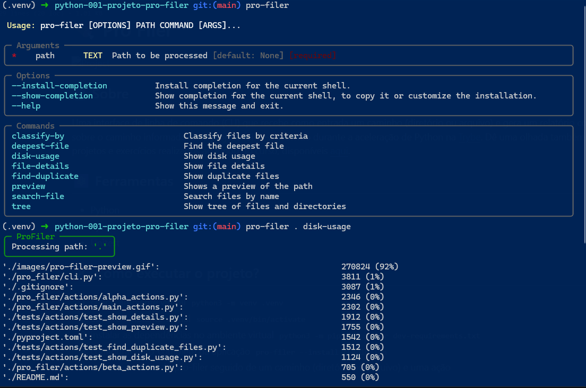
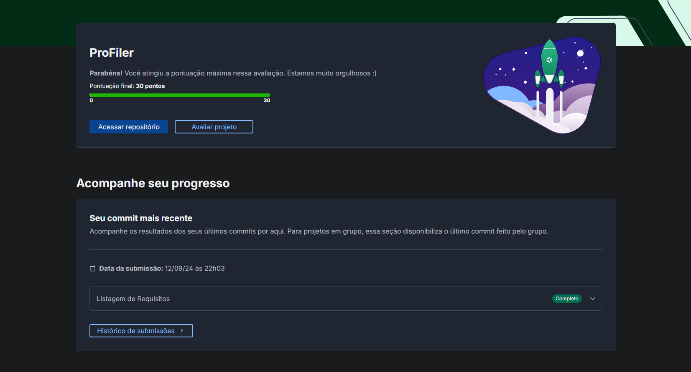

# 🍖 Pro Filer



## 📘 Sobre

Uma interface de linha de comando (CLI) que recebe como entrada um caminho (diretório ou arquivo) e gera um relatório com informações sobre o caminho informado. Este projeto foi desenvolvido durante a aceleração de Python na [Trybe](https://www.betrybe.com/). Dê uma olhada também nos meus outros projetos e exercícios realizados ao longo do curso, disponíveis [aqui](https://github.com/coelhoreinaldo/trybe-python-course).

## ⚛️ Ferramentas

- Python
- Pytest
- Unitest

## 🛠️ Como executar o projeto?

1. criar o ambiente virtual
```python3 -m venv .venv```
2. ativar o ambiente virtual
```source .venv/bin/activate```
3. instalar as dependências no ambiente virtual
```python3 -m pip install -r dev-requirements.txt```
4. configurar auto-complete da aplicação
```pro-filer --install-completion```
5. execute o comando pro-filer seguido de um caminho (diretório ou arquivo) e uma ação

## 📝 Nota


